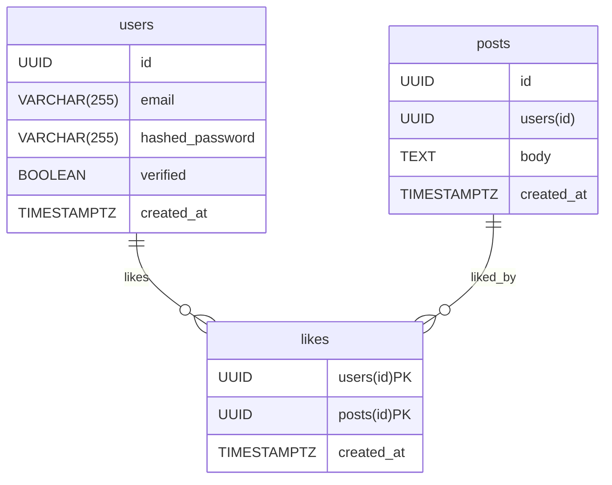

## ER

To process the changes of likes precisely, I made a table `likes` and let `users(id)` and `posts(id)` a composite primary key.

We can reject the duplicated likes by consulting the composite primary key.

like column v.s. Likes Table

In this app, we want to enable users to like a post only once and undo the like.

Therefore, we have to keep track of that who liked what posts.

Then, if you try to do this by adding a `like` column in posts, then it would break 1NF.

Therefore, we prefer to user Likes table to realize the functionality.